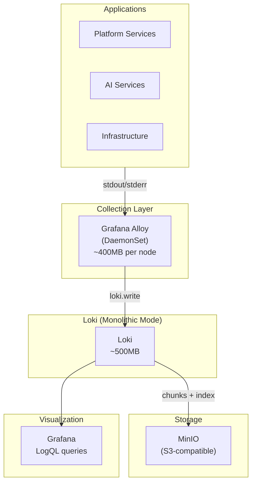
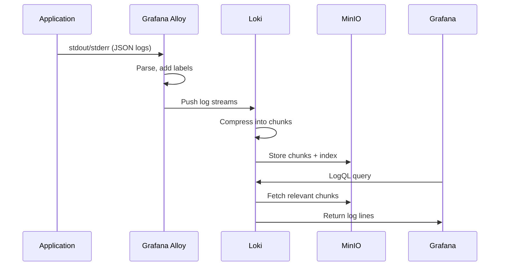

# ADR-020: Logging Stack - Grafana Loki

## Status
**Accepted**

## Date
2026-01-07

## Context

Talent Mesh requires a centralized logging solution for troubleshooting, debugging, and audit trails. Options considered:

1. **Elasticsearch + Kibana (ELK)**: Full-text indexing, powerful search
2. **OpenSearch + OpenSearch Dashboards**: ELK fork, Apache 2.0 license
3. **Grafana Loki**: Labels-only indexing, Grafana-native

Key constraints:
- **Limited resources**: 24GB RAM total across 3 nodes
- **Grafana ecosystem**: Already using Prometheus and Grafana
- **Object storage**: MinIO available for backend storage
- **Cost efficiency**: Minimize infrastructure overhead

## Decision

We will use **Grafana Loki** for centralized logging.

### Why Loki Over OpenSearch/ELK

| Factor | Loki | OpenSearch | Elasticsearch |
|--------|------|------------|---------------|
| **Indexing** | Labels only | Full-text | Full-text |
| **Memory (MVP)** | **~500MB** | ~2-4GB+ | ~2-4GB+ |
| **Storage backend** | Object storage (MinIO) ✅ | Local/cloud shards | Local/cloud shards |
| **Storage cost** | **3-10x cheaper** | Index overhead | Index overhead |
| **Query language** | LogQL (PromQL-like) | OpenSearch DSL | Lucene/KQL |
| **Grafana integration** | **Native** (same company) | Plugin required | Plugin required |
| **K8s native** | ✅ Designed for K8s | ⚠️ Heavier | ⚠️ Heavier |
| **License** | AGPLv3 | Apache 2.0 | Elastic License |

### Architecture



### Loki Deployment Mode

For MVP with 3 nodes, we use **Monolithic mode** (single binary):

| Mode | Description | When to Use |
|------|-------------|-------------|
| **Monolithic** | All components in single binary | < 100GB logs/day ✅ |
| Simple Scalable | Read/write/backend separation | 100GB - 1TB logs/day |
| Microservices | Full component separation | > 1TB logs/day |

### Log Labels Strategy

```yaml
# Kubernetes labels automatically added by Alloy
labels:
  namespace: "platform"
  pod: "auth-service-abc123"
  container: "auth-service"
  node: "node-1"

# Custom labels for filtering
labels:
  service: "auth-service"
  environment: "production"
  level: "error"  # Extracted from log line
```

### LogQL Query Examples

```logql
# All errors from auth-service
{namespace="platform", service="auth-service"} |= "error"

# JSON parsing with filtering
{namespace="platform"} | json | level="error" | line_format "{{.message}}"

# Rate of errors per service
sum(rate({namespace="platform"} |= "error" [5m])) by (service)

# Latency extraction from logs
{service="api-gateway"} | json | latency_ms > 1000
```

### Retention Configuration

```yaml
# Loki configuration
limits_config:
  retention_period: 30d          # Default retention

# Per-tenant overrides (if needed)
overrides:
  audit:
    retention_period: 365d       # Audit logs: 1 year
```

### Resource Requirements

| Component | Instances | Memory | CPU |
|-----------|-----------|--------|-----|
| Loki | 1 (monolithic) | ~500MB | 200m |
| Alloy (logs pipeline) | 3 (DaemonSet) | ~200MB each | 100m each |
| **Total** | | **~1.1GB** | ~500m |

## Consequences

### Positive

1. **Low memory**: ~500MB vs 2-4GB for OpenSearch
2. **Uses MinIO**: Already deployed, S3-compatible
3. **Grafana native**: Same query patterns as Prometheus (LogQL ≈ PromQL)
4. **Cost efficient**: No full-text index storage overhead
5. **Kubernetes native**: Designed for containerized environments
6. **Single collector**: Alloy handles logs + metrics + traces

### Negative

1. **No full-text search**: Must use labels + grep patterns
2. **Label cardinality**: Must be careful with high-cardinality labels
3. **Query limitations**: Complex searches slower than indexed solutions

### Mitigations

- Use structured logging (JSON) for easy field extraction
- Design label schema carefully to avoid cardinality explosion
- Use Loki's `| json` parser for ad-hoc field queries
- Consider Bloom filters (Loki 3.0+) for query acceleration

## Log Aggregation Flow



## Structured Logging Standard

All services must use JSON structured logging:

```json
{
  "timestamp": "2026-01-07T10:30:00.000Z",
  "level": "error",
  "service": "auth-service",
  "trace_id": "abc123",
  "span_id": "def456",
  "message": "LinkedIn OAuth failed",
  "error": "invalid_grant",
  "user_id": "usr_xyz",
  "duration_ms": 150
}
```

## References

- [Grafana Loki Documentation](https://grafana.com/docs/loki/latest/)
- [LogQL Query Language](https://grafana.com/docs/loki/latest/query/)
- [Loki vs Elasticsearch](https://grafana.com/blog/2020/05/12/an-only-slightly-technical-comparison-of-loki-and-elasticsearch/)
- [ADR-028: Unified Observability - Grafana Alloy](./ADR-028-UNIFIED-OBSERVABILITY-GRAFANA-ALLOY.md)

---

*ADR Version: 1.0*
*Last Updated: 2026-01-07*
