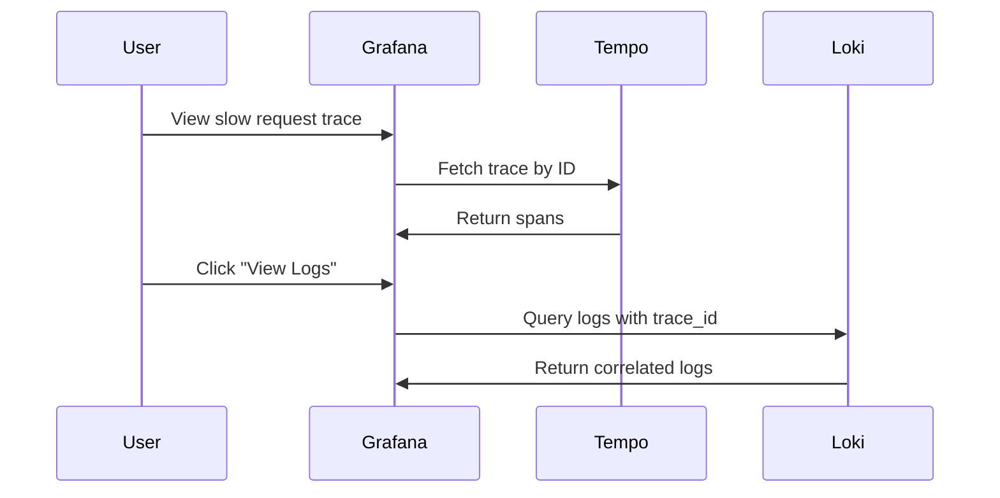

# ADR-024: Distributed Tracing - Grafana Tempo

## Status
**Accepted**

## Date
2026-01-07

## Context

Talent Mesh requires distributed tracing to:
- Debug request flows across microservices
- Identify performance bottlenecks
- Correlate logs, metrics, and traces

Options considered:

1. **Jaeger**: CNCF graduated, Elasticsearch/Cassandra backend
2. **Zipkin**: Original distributed tracing, simpler
3. **Grafana Tempo**: Grafana-native, object storage backend

## Decision

We will use **Grafana Tempo** for distributed tracing.

### Why Tempo Over Jaeger

| Factor | Tempo | Jaeger | Zipkin |
|--------|-------|--------|--------|
| **Storage** | Object storage (MinIO) ✅ | Elasticsearch/Cassandra | MySQL/Cassandra |
| **Indexing** | None (trace ID only) | Full trace indexing | Limited |
| **Memory** | **~300MB** | ~500MB-2GB | ~300-500MB |
| **Grafana integration** | **Native** (same company) | Plugin | Plugin |
| **Query language** | **TraceQL** | Jaeger Query | Basic |
| **Multi-tenancy** | ✅ Native | ❌ No | ❌ No |
| **OTLP support** | ✅ Native | ✅ Native | ⚠️ Partial |
| **Future** | Active development | ⚠️ Deprecated on OpenShift | Maintenance |

**Key insight:** Red Hat deprecated Jaeger on OpenShift (EOL end of 2025) in favor of Tempo.

### Architecture

```mermaid
flowchart TB
    subgraph apps["Applications (OTel Instrumented)"]
        platform["Platform Services<br/>@opentelemetry/sdk-node"]
        ai["AI Services<br/>opentelemetry-python"]
        rust["Rust Services<br/>opentelemetry-rust"]
    end

    subgraph collection["Collection"]
        alloy["Grafana Alloy<br/>(OTLP receiver)"]
    end

    subgraph tempo_cluster["Tempo"]
        tempo["Tempo<br/>~300MB"]
    end

    subgraph storage["Storage"]
        minio["MinIO<br/>(trace chunks)"]
    end

    subgraph viz["Visualization"]
        grafana["Grafana<br/>TraceQL + Trace View"]
    end

    apps -->|OTLP (gRPC/HTTP)| alloy
    alloy -->|otlp exporter| tempo
    tempo -->|chunks| minio
    tempo --> grafana
```

### TraceQL Examples

```traceql
# Find slow requests (>1s)
{duration > 1s}

# Find errors in auth-service
{span.service.name = "auth-service" && status = error}

# Find requests with specific user
{span.user_id = "usr_abc123"}

# Complex query: slow database calls in assessment flow
{span.service.name = "assessment-service" && span.db.system = "postgresql" && duration > 500ms}

# Find traces with high span count (potential N+1)
{spanCount > 100}
```

### Tempo Configuration

```yaml
# tempo.yaml
server:
  http_listen_port: 3200

distributor:
  receivers:
    otlp:
      protocols:
        grpc:
          endpoint: 0.0.0.0:4317
        http:
          endpoint: 0.0.0.0:4318

storage:
  trace:
    backend: s3
    s3:
      bucket: tempo-traces
      endpoint: minio:9000
      access_key: ${MINIO_ACCESS_KEY}
      secret_key: ${MINIO_SECRET_KEY}
      insecure: true  # MinIO internal
    wal:
      path: /var/tempo/wal
    local:
      path: /var/tempo/blocks

compactor:
  compaction:
    block_retention: 336h  # 14 days

querier:
  frontend_worker:
    frontend_address: tempo:9095

metrics_generator:
  registry:
    external_labels:
      source: tempo
  storage:
    path: /var/tempo/generator/wal
    remote_write:
      - url: http://prometheus:9090/api/v1/write
```

### Kubernetes Deployment

```yaml
apiVersion: apps/v1
kind: Deployment
metadata:
  name: tempo
  namespace: observability
spec:
  replicas: 1
  selector:
    matchLabels:
      app: tempo
  template:
    metadata:
      labels:
        app: tempo
    spec:
      containers:
      - name: tempo
        image: grafana/tempo:2.3.0
        args:
        - -config.file=/etc/tempo/tempo.yaml
        ports:
        - containerPort: 3200   # HTTP
        - containerPort: 4317   # OTLP gRPC
        - containerPort: 4318   # OTLP HTTP
        - containerPort: 9095   # gRPC (internal)
        resources:
          requests:
            memory: "300Mi"
            cpu: "100m"
          limits:
            memory: "512Mi"
            cpu: "500m"
        volumeMounts:
        - name: config
          mountPath: /etc/tempo
        - name: data
          mountPath: /var/tempo
      volumes:
      - name: config
        configMap:
          name: tempo-config
      - name: data
        emptyDir: {}
```

### Trace Context Propagation

All services must propagate W3C Trace Context headers:

```typescript
// Node.js with OpenTelemetry
import { W3CTraceContextPropagator } from '@opentelemetry/core';
import { NodeSDK } from '@opentelemetry/sdk-node';

const sdk = new NodeSDK({
  textMapPropagator: new W3CTraceContextPropagator(),
  // ... other config
});
```

Headers propagated:
```http
traceparent: 00-0af7651916cd43dd8448eb211c80319c-b7ad6b7169203331-01
tracestate: talent-mesh=...
```

### Grafana Data Source

```yaml
apiVersion: v1
kind: ConfigMap
metadata:
  name: grafana-datasources
  namespace: observability
data:
  tempo.yaml: |
    apiVersion: 1
    datasources:
    - name: Tempo
      type: tempo
      url: http://tempo:3200
      access: proxy
      jsonData:
        tracesToLogs:
          datasourceUid: loki
          tags: ['service.name', 'trace_id']
          mappedTags: [{ key: 'service.name', value: 'service' }]
          mapTagNamesEnabled: true
          filterByTraceID: true
        tracesToMetrics:
          datasourceUid: prometheus
          tags: [{ key: 'service.name', value: 'service' }]
        serviceMap:
          datasourceUid: prometheus
        nodeGraph:
          enabled: true
        search:
          hide: false
        lokiSearch:
          datasourceUid: loki
```

### Trace-to-Logs Correlation

With Tempo + Loki + Grafana, you can jump from a trace to related logs:



### Resource Requirements

| Component | Instances | Memory | CPU |
|-----------|-----------|--------|-----|
| Tempo | 1 | ~300MB | 100m |
| Storage (MinIO) | Shared | Included | Included |
| **Total** | | **~300MB** | ~100m |

## Consequences

### Positive

1. **Uses MinIO**: No additional storage infrastructure
2. **No indexing overhead**: Cheaper storage than Jaeger
3. **Native Grafana**: TraceQL, service maps, trace-to-logs
4. **Low memory**: ~300MB vs Jaeger's ~500MB-2GB
5. **Multi-tenant**: Ready for future org isolation
6. **Metrics generation**: Can generate RED metrics from traces

### Negative

1. **Trace ID required**: No label-based trace search (unlike Jaeger)
2. **Newer project**: Less ecosystem than Jaeger
3. **TraceQL learning**: New query language to learn

### Mitigations

- Use exemplars in Prometheus to link metrics to traces
- Use Loki logs to find trace IDs, then query Tempo
- TraceQL is similar to LogQL/PromQL (consistent learning)

## References

- [Grafana Tempo Documentation](https://grafana.com/docs/tempo/latest/)
- [TraceQL Query Language](https://grafana.com/docs/tempo/latest/traceql/)
- [Red Hat: Jaeger to Tempo Migration](https://developers.redhat.com/articles/2025/04/09/best-practices-migration-jaeger-tempo)
- [OpenTelemetry Integration](https://grafana.com/docs/tempo/latest/set-up-for-tracing/)
- [ADR-028: Unified Observability - Grafana Alloy](./ADR-028-UNIFIED-OBSERVABILITY-GRAFANA-ALLOY.md)

---

*ADR Version: 1.0*
*Last Updated: 2026-01-07*
