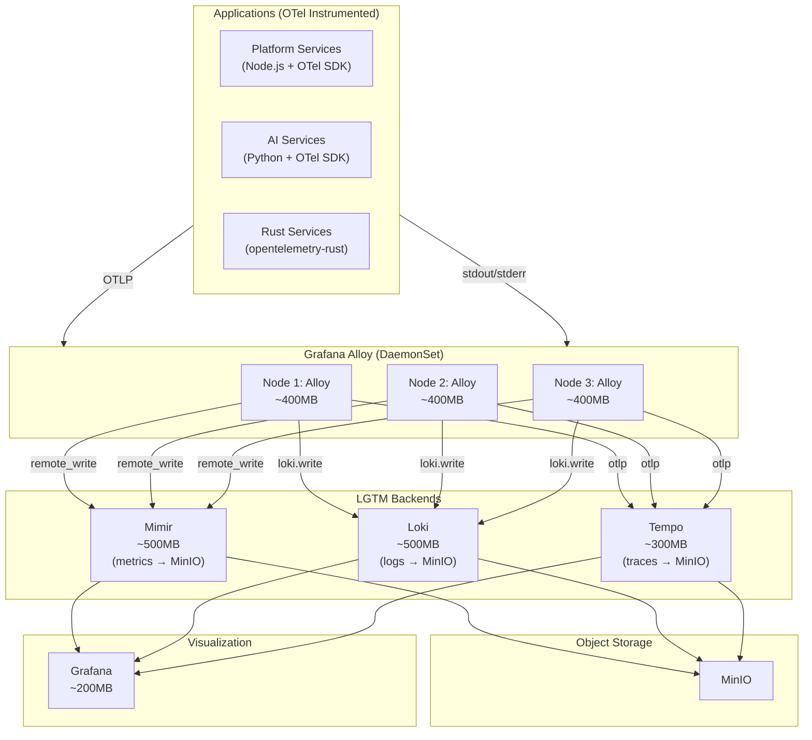
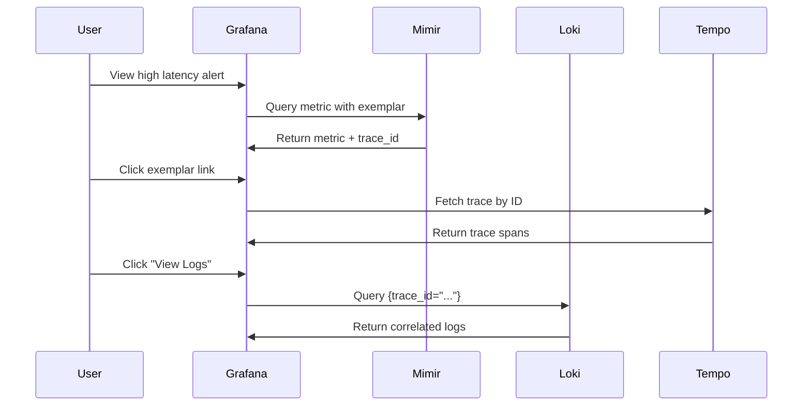

# ADR-028: Unified Observability - Grafana Alloy (LGTM Stack)

## Status
**Accepted**

## Date
2026-01-07

## Context

Talent Mesh requires comprehensive observability covering:
- **Metrics**: System and application performance
- **Logs**: Centralized log aggregation
- **Traces**: Distributed request tracing

Options for telemetry collection:

1. **Multiple agents**: Prometheus + Promtail + OTel Collector
2. **OpenTelemetry Collector**: CNCF standard, vendor-neutral
3. **Grafana Alloy**: OTel distribution with Prometheus pipelines

## Decision

We will use the **Grafana LGTM Stack** with **Grafana Alloy** as the unified telemetry collector.

### LGTM Stack Components

| Component | Role | Alternative Replaced |
|-----------|------|---------------------|
| **L**oki | Logs | Elasticsearch, OpenSearch |
| **G**rafana | Visualization | Kibana, multiple dashboards |
| **T**empo | Traces | Jaeger, Zipkin |
| **M**etrics (Mimir) | Metrics | Prometheus, InfluxDB, Graphite |
| **Alloy** | Collection | Promtail + node_exporter + OTel |

> **Note:** We use Mimir instead of Prometheus for long-term retention capability. See [ADR-029](/docs/09-adrs/ADR-029-METRICS-MIMIR-OTEL.md).

### Why Grafana Alloy

| Factor | Alloy | OTel Collector | Multiple Agents |
|--------|-------|----------------|-----------------|
| **Signals** | Metrics, Logs, Traces, Profiles | Metrics, Logs, Traces | Varies |
| **Binaries** | **1** | 1 | 3-4 |
| **Configuration** | River (expression-based) | YAML | Multiple formats |
| **Prometheus scraping** | ✅ Built-in | Via receiver | Separate agent |
| **Loki pipeline** | ✅ Built-in | Via exporter | Promtail |
| **Grafana integration** | ✅ Native | Compatible | Compatible |
| **Clustering** | ✅ Native | Manual | No |
| **GitOps** | ✅ Pull from Git/S3 | ConfigMaps | Multiple |

### Architecture



### Alloy Configuration (River)

```hcl
// alloy-config.river

// ===== OTLP Receiver (for application traces/metrics) =====
otelcol.receiver.otlp "default" {
  grpc {
    endpoint = "0.0.0.0:4317"
  }
  http {
    endpoint = "0.0.0.0:4318"
  }
  output {
    metrics = [otelcol.processor.batch.default.input]
    logs    = [otelcol.processor.batch.default.input]
    traces  = [otelcol.processor.batch.default.input]
  }
}

// ===== Batch Processor =====
otelcol.processor.batch "default" {
  output {
    metrics = [otelcol.exporter.prometheus.default.input]
    logs    = [otelcol.exporter.loki.default.input]
    traces  = [otelcol.exporter.otlp.tempo.input]
  }
}

// ===== Prometheus Scraping (to Mimir) =====
prometheus.scrape "kubernetes_pods" {
  targets    = discovery.kubernetes.pods.targets
  forward_to = [prometheus.remote_write.mimir.receiver]
}

discovery.kubernetes "pods" {
  role = "pod"
  namespaces {
    names = ["platform", "ai", "databases", "email", "observability"]
  }
}

prometheus.remote_write "mimir" {
  endpoint {
    url = "http://mimir:9009/api/v1/push"
  }
}

// ===== Log Collection =====
loki.source.kubernetes "pods" {
  targets    = discovery.kubernetes.pods.targets
  forward_to = [loki.process.default.receiver]
}

loki.process "default" {
  stage.json {
    expressions = {
      level   = "level",
      message = "message",
      trace_id = "trace_id",
    }
  }
  stage.labels {
    values = {
      level = "",
    }
  }
  forward_to = [loki.write.default.receiver]
}

loki.write "default" {
  endpoint {
    url = "http://loki:3100/loki/api/v1/push"
  }
}

// ===== Trace Export =====
otelcol.exporter.otlp "tempo" {
  client {
    endpoint = "tempo:4317"
    tls {
      insecure = true
    }
  }
}

// ===== Prometheus Exporter (for OTel metrics to Mimir) =====
otelcol.exporter.prometheus "default" {
  forward_to = [prometheus.remote_write.mimir.receiver]
}

// ===== Loki Exporter (for OTel logs) =====
otelcol.exporter.loki "default" {
  forward_to = [loki.write.default.receiver]
}
```

### Kubernetes Deployment

```yaml
apiVersion: apps/v1
kind: DaemonSet
metadata:
  name: alloy
  namespace: observability
spec:
  selector:
    matchLabels:
      app: alloy
  template:
    metadata:
      labels:
        app: alloy
    spec:
      serviceAccountName: alloy
      containers:
      - name: alloy
        image: grafana/alloy:v1.3.0
        args:
        - run
        - /etc/alloy/config.river
        - --storage.path=/var/lib/alloy/data
        - --server.http.listen-addr=0.0.0.0:12345
        ports:
        - containerPort: 4317   # OTLP gRPC
        - containerPort: 4318   # OTLP HTTP
        - containerPort: 12345  # Alloy UI
        resources:
          requests:
            memory: "256Mi"
            cpu: "100m"
          limits:
            memory: "512Mi"
            cpu: "500m"
        volumeMounts:
        - name: config
          mountPath: /etc/alloy
        - name: varlog
          mountPath: /var/log
          readOnly: true
        - name: data
          mountPath: /var/lib/alloy/data
      volumes:
      - name: config
        configMap:
          name: alloy-config
      - name: varlog
        hostPath:
          path: /var/log
      - name: data
        emptyDir: {}
```

### Application Instrumentation

#### Node.js (TypeScript)

```typescript
import { NodeSDK } from '@opentelemetry/sdk-node';
import { OTLPTraceExporter } from '@opentelemetry/exporter-trace-otlp-grpc';
import { OTLPMetricExporter } from '@opentelemetry/exporter-metrics-otlp-grpc';
import { getNodeAutoInstrumentations } from '@opentelemetry/auto-instrumentations-node';

const sdk = new NodeSDK({
  serviceName: 'auth-service',
  traceExporter: new OTLPTraceExporter({
    url: 'http://alloy:4317',
  }),
  metricReader: new PeriodicExportingMetricReader({
    exporter: new OTLPMetricExporter({
      url: 'http://alloy:4317',
    }),
    exportIntervalMillis: 30000,
  }),
  instrumentations: [getNodeAutoInstrumentations()],
});

sdk.start();
```

#### Python

```python
from opentelemetry import trace
from opentelemetry.sdk.trace import TracerProvider
from opentelemetry.sdk.trace.export import BatchSpanProcessor
from opentelemetry.exporter.otlp.proto.grpc.trace_exporter import OTLPSpanExporter

trace.set_tracer_provider(TracerProvider())
tracer_provider = trace.get_tracer_provider()

otlp_exporter = OTLPSpanExporter(endpoint="http://alloy:4317", insecure=True)
tracer_provider.add_span_processor(BatchSpanProcessor(otlp_exporter))

tracer = trace.get_tracer(__name__)
```

### Grafana Dashboards

Pre-configured dashboards for:

1. **Kubernetes Overview**: Node health, pod status, resource usage
2. **Service Health**: RED metrics (Rate, Errors, Duration)
3. **Database Monitoring**: PostgreSQL, MongoDB metrics
4. **Trace Explorer**: Tempo trace search and analysis
5. **Log Explorer**: Loki log search with LogQL
6. **Security Metrics**: Trivy vulnerability summary (via Pushgateway)

### Trace-Log-Metric Correlation



### Resource Summary

| Component | Instances | Memory | CPU |
|-----------|-----------|--------|-----|
| Alloy (DaemonSet) | 3 | ~400MB each | 100m each |
| Mimir (monolithic) | 1 | ~500MB | 200m |
| Loki | 1 | ~500MB | 200m |
| Tempo | 1 | ~300MB | 100m |
| Grafana | 1 | ~200MB | 100m |
| ztunnel (DaemonSet) | 3 | ~100MB each | 50m each |
| **Total** | | **~3GB** | ~1050m |

## Consequences

### Positive

1. **Single collector**: Alloy replaces Promtail + node_exporter + OTel Collector
2. **Unified configuration**: One River config for all signals
3. **Native Grafana**: Same company, seamless integration
4. **Correlation**: Traces ↔ Logs ↔ Metrics linked in Grafana
5. **OpenTelemetry**: 100% OTLP compatible, future-proof
6. **MinIO backend**: Loki + Tempo use existing storage

### Negative

1. **Alloy learning curve**: River syntax is new
2. **Memory overhead**: ~400MB per node for DaemonSet
3. **Grafana dependency**: Tightly coupled to Grafana ecosystem

### Mitigations

- River syntax is well-documented and similar to HCL
- Memory can be reduced by disabling unused components
- Grafana ecosystem is mature and widely adopted

## Migration Note

Grafana Agent reaches EOL in November 2025. Alloy is the official successor.

## References

- [Grafana Alloy Documentation](https://grafana.com/docs/alloy/latest/)
- [Grafana Alloy GitHub](https://github.com/grafana/alloy)
- [LGTM Stack Setup](https://www.hostinger.com/tutorials/how-to-set-up-lgtm-stack)
- [OpenTelemetry Integration](https://grafana.com/docs/alloy/latest/collect/opentelemetry-to-lgtm-stack/)
- [ADR-020: Logging - Grafana Loki](./ADR-020-LOGGING-GRAFANA-LOKI.md)
- [ADR-024: Tracing - Grafana Tempo](./ADR-024-DISTRIBUTED-TRACING-GRAFANA-TEMPO.md)
- [ADR-029: Metrics - Mimir with OTel SDK](./ADR-029-METRICS-MIMIR-OTEL.md)

---

*ADR Version: 2.0*
*Last Updated: 2026-01-07*
