# ADR-029: Metrics with Mimir and Application OTel SDKs

## Status
**Accepted**

## Date
2026-01-07

## Context

Talent Mesh requires metrics storage with the following characteristics:
- Long-term retention for trend analysis
- Efficient storage on limited SSD (600GB total)
- Future scalability path
- PromQL compatibility

Additionally, we need to decide how to collect L7 (HTTP) metrics and distributed traces:
1. **Istio waypoint proxies**: Mesh-level L7 proxies (Envoy) that automatically capture HTTP metrics
2. **Istio sidecars**: Traditional per-pod Envoy sidecars
3. **Application OTel SDKs**: Instrumentation within application code

## Decision

### 1. Metrics Backend: Mimir (Monolithic Mode)

We will use **Grafana Mimir** in monolithic mode instead of Prometheus.

| Factor | Mimir (Monolithic) | Prometheus |
|--------|-------------------|------------|
| **RAM** | ~500MB | ~500MB |
| **Storage backend** | MinIO (S3-compatible) | Local disk |
| **Retention** | Years (object storage) | ~15-31 days |
| **Horizontal scaling** | ✅ Future path | ❌ Single node |
| **Multi-tenancy** | ✅ Built-in | ❌ No |
| **PromQL** | 100% compatible | Native |
| **High availability** | ✅ With distributed mode | ❌ Single point of failure |

**Monolithic mode** runs all Mimir components in a single binary, providing the same footprint as Prometheus while enabling:
- Long-term storage to MinIO (local SSD)
- Future migration to distributed mode without application changes
- Multi-tenancy for white-label platform

### 2. L7 Observability: Application OTel SDKs (No Waypoints)

We will NOT use Istio waypoint proxies. Instead, L7 telemetry comes from **Application OTel SDKs**.

| Approach | RAM Overhead | Network Hops | L7 Metrics | Traces |
|----------|--------------|--------------|------------|--------|
| **Sidecars** | ~3.8GB (30 pods × 128MB) | None | ✅ Auto | ✅ Auto |
| **Waypoints (distributed)** | ~1.9GB (5 ns × 3 replicas × 128MB) | +1 hop | ✅ Auto | ✅ Auto |
| **Waypoints (single)** | ~640MB | +1-2 hops | ✅ Auto | ✅ Auto |
| **App OTel SDK + ztunnel** | **~300MB** | **None** | ✅ Manual | ✅ Manual |

**Why NOT waypoints?**

1. **Network inefficiency**: Traffic goes Pod A → ztunnel → Waypoint (potentially different node) → ztunnel → Pod B. With waypoints on a different node, this adds latency.

2. **Redundant with OTel**: Since all our microservices are instrumented with OTel SDKs, waypoints would duplicate the same metrics and traces.

3. **RAM savings**: ~640MB-3.5GB saved by skipping mesh-level L7 proxies.

4. **Third-party products**: Databases (PostgreSQL, MongoDB, Dragonfly) use non-HTTP protocols that waypoints cannot parse anyway.

### 3. Service Mesh: Istio Ambient with ztunnel Only

We will use **Istio Ambient Mode with ztunnel only** (no waypoints, no sidecars).

```mermaid
flowchart TB
    subgraph apps["Microservices (OTel SDK)"]
        auth["Auth Service"]
        user["User Service"]
        assess["Assessment Service"]
    end

    subgraph mesh["Istio Ambient"]
        zt["ztunnel (DaemonSet)<br/>~100MB × 3 nodes<br/>L4 only: mTLS, TCP metrics"]
    end

    subgraph observability["Observability"]
        alloy["Grafana Alloy"]
        mimir["Mimir"]
        tempo["Tempo"]
    end

    apps -->|"OTLP (traces, metrics)"| alloy
    zt -->|"L4 metrics"| alloy
    alloy --> mimir & tempo

    apps <-->|"mTLS via ztunnel"| apps
```



**ztunnel provides:**
- mTLS encryption (zero-trust)
- TCP connection metrics (count, bytes, duration)
- L4 authorization policies

**ztunnel does NOT provide** (and we don't need from mesh):
- HTTP metrics (from app OTel)
- Distributed traces (from app OTel)
- HTTP-level routing (handled by Istio Gateway)

### 4. Third-Party Observability: Built-in Exporters

Third-party products use their **built-in metrics exporters**, not mesh-level proxies:

| Product | Protocol | Exporter | Metrics |
|---------|----------|----------|---------|
| PostgreSQL (CNPG) | PG wire | :9187 | Queries/sec, connections, replication |
| MongoDB | MongoDB wire | :9216 | Ops/sec, documents, replica status |
| Dragonfly | Redis protocol | :6379 | Memory, keys, commands/sec |
| MinIO | HTTP | :9000 | Requests, storage, bandwidth |
| Redpanda | Kafka protocol | :9644 | Throughput, lag, partitions |
| Stalwart | SMTP/IMAP | :8080 | Emails, queue depth |
| ztunnel | Internal | :15020 | TCP connections, mTLS status |

**Why not sidecars/waypoints for third-party?**
- Sidecars/waypoints only understand HTTP/gRPC
- Database protocols (PostgreSQL, MongoDB, Redis) cannot be parsed by Envoy
- L4 (TCP) metrics are the same whether from sidecar or ztunnel

## Architecture


## Mimir Configuration

```yaml
# mimir-config.yaml
target: all  # Monolithic mode

common:
  storage:
    backend: s3
    s3:
      endpoint: minio.databases.svc:9000
      bucket_name: mimir-blocks
      access_key_id: ${MINIO_ACCESS_KEY}
      secret_access_key: ${MINIO_SECRET_KEY}
      insecure: true

blocks_storage:
  backend: s3
  tsdb:
    dir: /data/tsdb
  bucket_store:
    sync_dir: /data/tsdb-sync

limits:
  max_global_series_per_user: 1000000
  compactor_blocks_retention_period: 365d  # 1 year

compactor:
  data_dir: /data/compactor
```

## Alloy Configuration (Remote Write to Mimir)

```hcl
// Scrape third-party exporters
prometheus.scrape "postgres" {
  targets    = [{"__address__" = "postgres.databases:9187"}]
  forward_to = [prometheus.remote_write.mimir.receiver]
}

prometheus.scrape "mongodb" {
  targets    = [{"__address__" = "mongodb.databases:9216"}]
  forward_to = [prometheus.remote_write.mimir.receiver]
}

prometheus.scrape "ztunnel" {
  targets    = discovery.kubernetes.pods.targets
  job_name   = "ztunnel"
  relabel_configs = [{
    source_labels = ["__meta_kubernetes_pod_label_app"]
    regex         = "ztunnel"
    action        = "keep"
  }]
  forward_to = [prometheus.remote_write.mimir.receiver]
}

// Remote write to Mimir
prometheus.remote_write "mimir" {
  endpoint {
    url = "http://mimir:9009/api/v1/push"
  }
}
```

## Consequences

### Positive

1. **~3.5GB RAM saved** vs sidecars, ~640MB-1.9GB vs waypoints
2. **No extra network hops** for service-to-service traffic
3. **Long-term metrics retention** via Mimir + MinIO
4. **Future scalability** - Mimir can scale to distributed mode
5. **Full L7 observability** from application OTel SDKs
6. **Deep database visibility** from dedicated exporters
7. **Simpler architecture** - no waypoint deployment complexity

### Negative

1. **Manual instrumentation required** - every service needs OTel SDK setup
2. **No automatic trace propagation** at mesh level (handled by app OTel)
3. **Third-party services** without exporters would need waypoints (none in our stack)

### Neutral

1. **Same storage cost** - Mimir and Prometheus both use MinIO
2. **Same PromQL** - all queries work identically
3. **Migration effort** - minimal, just change remote_write endpoint

## Resource Summary

| Component | Instances | Memory |
|-----------|-----------|--------|
| ztunnel (DaemonSet) | 3 | ~300MB |
| Alloy (DaemonSet) | 3 | ~1.2GB |
| Mimir (monolithic) | 1 | ~500MB |
| Loki | 1 | ~500MB |
| Tempo | 1 | ~300MB |
| Grafana | 1 | ~200MB |
| **Total** | | **~3GB** |

**NOT included (by design):**
- Envoy sidecars: ~3.8GB saved
- Waypoint proxies: ~640MB-1.9GB saved

## Alternatives Considered

### 1. Prometheus (Rejected)
- Same footprint but no long-term retention
- No horizontal scaling path
- Single point of failure

### 2. Istio Sidecars (Rejected)
- ~3.8GB RAM overhead
- Redundant with OTel SDK instrumentation
- Slower pod startup

### 3. Istio Waypoints (Rejected)
- ~640MB-1.9GB RAM overhead
- Extra network hops (waypoint may be on different node)
- Redundant with OTel SDK instrumentation
- Cannot parse database protocols anyway

### 4. Victoria Metrics (Considered)
- Excellent performance but less Grafana integration
- Smaller community than Mimir
- Mimir preferred for LGTM stack consistency

## Related ADRs

- [ADR-020: Logging - Grafana Loki](/docs/09-adrs/ADR-020-LOGGING-GRAFANA-LOKI.md)
- [ADR-024: Distributed Tracing - Grafana Tempo](/docs/09-adrs/ADR-024-DISTRIBUTED-TRACING-GRAFANA-TEMPO.md)
- [ADR-028: Unified Observability - Grafana Alloy](/docs/09-adrs/ADR-028-UNIFIED-OBSERVABILITY-GRAFANA-ALLOY.md)

## References

- [Grafana Mimir Documentation](https://grafana.com/docs/mimir/latest/)
- [Istio Ambient Mode](https://istio.io/latest/docs/ambient/)
- [OpenTelemetry SDK](https://opentelemetry.io/docs/instrumentation/)
- [CNPG Monitoring](https://cloudnative-pg.io/documentation/current/monitoring/)
