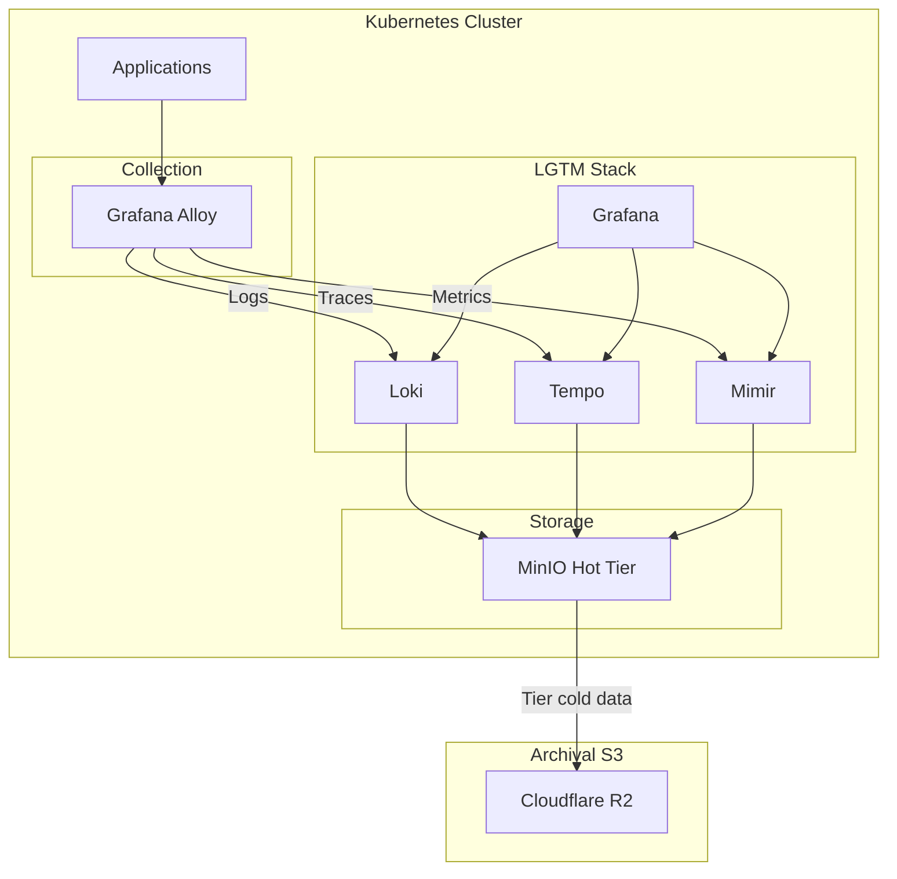
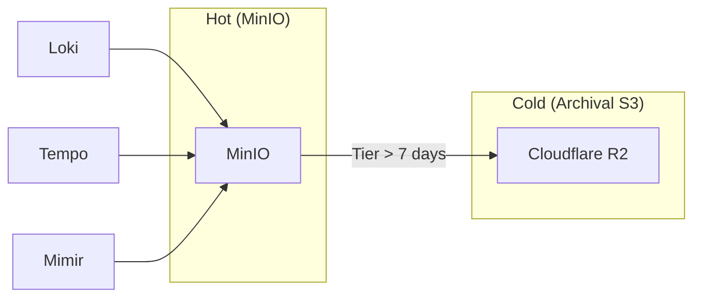
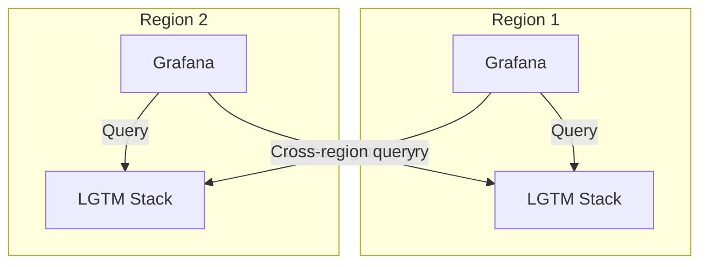

# ADR: Unified Observability Stack (Grafana LGTM)

**Status:** Accepted
**Date:** 2024-04-01
**Updated:** 2026-01-16

## Context

Need unified observability for logs, metrics, and traces with cost-effective storage.

## Decision

Use **Grafana LGTM stack** with Alloy as unified collector and MinIO for hot storage:
- **L**oki for logs
- **G**rafana for visualization
- **T**empo for traces
- **M**imir for metrics
- **Alloy** for collection

## Architecture



## Rationale

| Approach | Pros | Cons |
|----------|------|------|
| Separate tools | Best-of-breed | Complex, multiple UIs |
| **Grafana stack** | Unified, correlated | Single vendor | **Selected** |
| Cloud services | Zero ops | Cost, vendor lock-in |

**Key Decision Factors:**
- Single pane of glass
- Trace-to-log correlation
- Self-hosted (cost control)
- Open source
- MinIO for hot storage

## Components

| Component | Purpose | Memory |
|-----------|---------|--------|
| Loki | Log aggregation | ~500MB |
| Grafana | Visualization | ~200MB |
| Tempo | Distributed tracing | ~300MB |
| Mimir | Metrics storage | ~500MB |
| Alloy | Unified collector | ~400MB x3 |
| **Total** | | ~3GB |

## Storage Architecture



| Tier | Storage | Latency | Retention |
|------|---------|---------|-----------|
| Hot | MinIO | < 1ms | 7 days |
| Cold | Archival S3 | 50-200ms | 30-365 days |

See [ADR-OBJECT-STORAGE](../../minio/docs/ADR-OBJECT-STORAGE.md) for tiering details.

## Alloy Consolidation

Alloy replaces multiple collectors:
- Promtail → Alloy
- node_exporter → Alloy
- OTel Collector → Alloy

```yaml
# alloy.river
logging {
  level = "info"
}

// Scrape Kubernetes pods
discovery.kubernetes "pods" {
  role = "pod"
}

// Forward logs to Loki
loki.write "default" {
  endpoint {
    url = "http://loki.observability:3100/loki/api/v1/push"
  }
}

// Forward metrics to Mimir
prometheus.remote_write "default" {
  endpoint {
    url = "http://mimir.observability:9090/api/v1/push"
  }
}

// Forward traces to Tempo
otelcol.exporter.otlp "tempo" {
  client {
    endpoint = "tempo.observability:4317"
    tls {
      insecure = true
    }
  }
}
```

## Retention Policy

| Data Type | Hot (MinIO) | Cold (Archival) | Total |
|-----------|-------------|-----------------|-------|
| Logs | 7 days | 83 days | 90 days |
| Traces | 7 days | 23 days | 30 days |
| Metrics | 7 days | 358 days | 365 days |

## Multi-Region Observability



Each region has its own LGTM stack. Cross-region queries possible via Grafana datasource configuration.

## Consequences

**Positive:**
- Unified view (single pane of glass)
- Trace-to-log correlation
- Cost control (self-hosted + tiering)
- Open source

**Negative:**
- Self-hosted ops burden
- ~3GB memory overhead
- Tiering adds complexity

## Related

- [ADR-OBJECT-STORAGE](../../minio/docs/ADR-OBJECT-STORAGE.md)
- [ADR-BACKUP](../../velero/docs/ADR-BACKUP.md)
