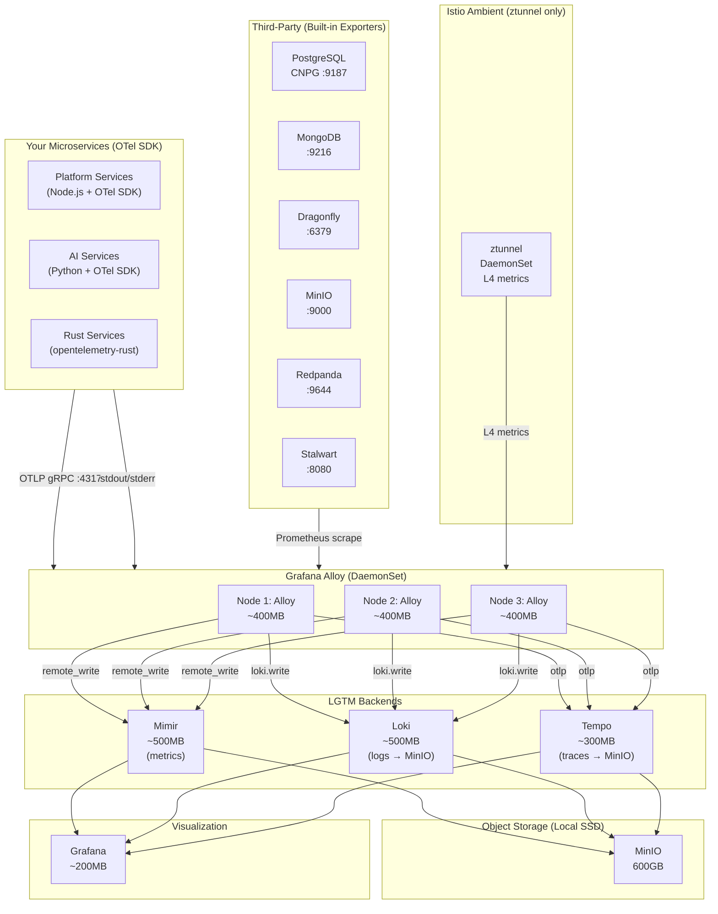
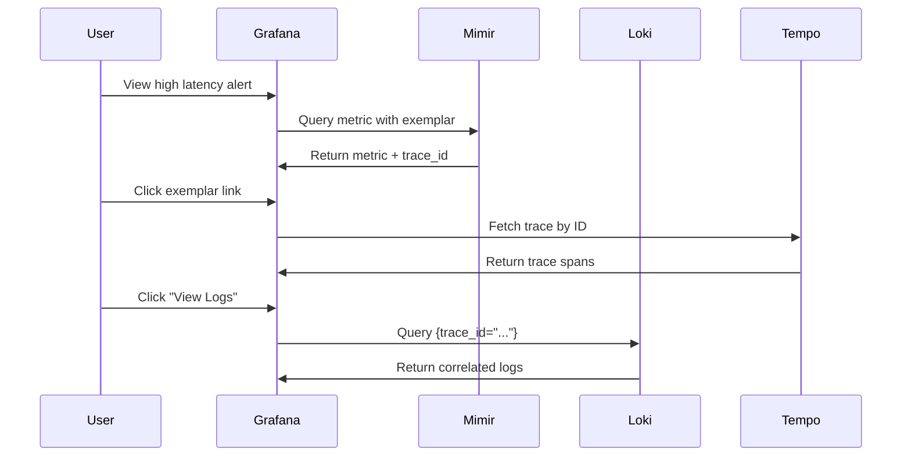

# Talent Mesh Observability Stack

## Overview

Talent Mesh uses the **Grafana LGTM Stack** with **Application OTel SDKs** for comprehensive observability:

| Component | Role | Technology | Memory |
|-----------|------|------------|--------|
| **L**ogs | Log aggregation | Grafana Loki | ~500MB |
| **G**rafana | Visualization | Grafana | ~200MB |
| **T**races | Distributed tracing | Grafana Tempo | ~300MB |
| **M**etrics | Metrics storage | **Mimir (monolithic)** | ~500MB |
| **Collector** | Unified telemetry | Grafana Alloy | ~400MB x3 |
| **Mesh** | L4 mTLS + metrics | ztunnel (DaemonSet) | ~100MB x3 |
| **Total** | | | **~3GB** |

### Key Architecture Decisions

- **Application OTel SDKs** for L7 telemetry (traces, HTTP metrics) - NOT mesh-level waypoints
- **Istio Ambient Mode with ztunnel only** - L4 mTLS and TCP metrics, no Envoy sidecars
- **NO waypoints** - applications handle their own L7 observability via OTel
- **NO sidecars** - saves ~3.5GB RAM vs traditional Istio
- **Mimir** instead of Prometheus - same footprint, long-term retention ready
- **Third-party products** use built-in exporters (CNPG, MongoDB, etc.)

---

## Architecture



### Observability Layers

| Layer | Source | What It Provides |
|-------|--------|------------------|
| **Application OTel SDK** | Your microservices | HTTP metrics, distributed traces, custom business metrics |
| **ztunnel (L4)** | Istio Ambient | mTLS, TCP connection count, bytes, connection duration |
| **Built-in Exporters** | Third-party products | Database-specific metrics (queries/sec, connections, replication) |

> **Why NO waypoints?** Waypoints (Envoy L7 proxies) would duplicate what OTel SDKs already provide. They also add network hops and ~640MB-1.9GB RAM overhead. Since all our microservices have OTel SDKs, waypoints are redundant.

---

## Grafana Alloy (Unified Collector)

### Why Alloy?

Grafana Alloy replaces multiple agents with a single binary:

| Before | After |
|--------|-------|
| Promtail (log collection) | Grafana Alloy |
| node_exporter (host metrics) | Grafana Alloy |
| OTel Collector (traces) | Grafana Alloy |
| **3+ binaries** | **1 binary** |

### Key Features

- **100% OpenTelemetry compatible** - OTLP receiver for all signals
- **River configuration** - Expression-based config (similar to HCL)
- **Native Grafana integration** - Same company, seamless setup
- **Built-in clustering** - For high availability
- **GitOps support** - Pull config from Git/S3

### Deployment (DaemonSet)

```yaml
apiVersion: apps/v1
kind: DaemonSet
metadata:
  name: alloy
  namespace: observability
spec:
  selector:
    matchLabels:
      app: alloy
  template:
    metadata:
      labels:
        app: alloy
    spec:
      serviceAccountName: alloy
      containers:
      - name: alloy
        image: grafana/alloy:v1.3.0
        args:
        - run
        - /etc/alloy/config.river
        - --storage.path=/var/lib/alloy/data
        - --server.http.listen-addr=0.0.0.0:12345
        ports:
        - containerPort: 4317   # OTLP gRPC
        - containerPort: 4318   # OTLP HTTP
        - containerPort: 12345  # Alloy UI
        resources:
          requests:
            memory: "256Mi"
            cpu: "100m"
          limits:
            memory: "512Mi"
            cpu: "500m"
```

### River Configuration

```hcl
// alloy-config.river

// ===== OTLP Receiver (for application traces/metrics) =====
otelcol.receiver.otlp "default" {
  grpc {
    endpoint = "0.0.0.0:4317"
  }
  http {
    endpoint = "0.0.0.0:4318"
  }
  output {
    metrics = [otelcol.processor.batch.default.input]
    logs    = [otelcol.processor.batch.default.input]
    traces  = [otelcol.processor.batch.default.input]
  }
}

// ===== Batch Processor =====
otelcol.processor.batch "default" {
  output {
    metrics = [otelcol.exporter.prometheus.default.input]
    logs    = [otelcol.exporter.loki.default.input]
    traces  = [otelcol.exporter.otlp.tempo.input]
  }
}

// ===== Prometheus Scraping (to Mimir) =====
prometheus.scrape "kubernetes_pods" {
  targets    = discovery.kubernetes.pods.targets
  forward_to = [prometheus.remote_write.mimir.receiver]
}

discovery.kubernetes "pods" {
  role = "pod"
  namespaces {
    names = ["platform", "ai", "databases", "email", "observability"]
  }
}

prometheus.remote_write "mimir" {
  endpoint {
    url = "http://mimir:9009/api/v1/push"
  }
}

// ===== Log Collection =====
loki.source.kubernetes "pods" {
  targets    = discovery.kubernetes.pods.targets
  forward_to = [loki.process.default.receiver]
}

loki.process "default" {
  stage.json {
    expressions = {
      level   = "level",
      message = "message",
      trace_id = "trace_id",
    }
  }
  stage.labels {
    values = {
      level = "",
    }
  }
  forward_to = [loki.write.default.receiver]
}

loki.write "default" {
  endpoint {
    url = "http://loki:3100/loki/api/v1/push"
  }
}

// ===== Trace Export =====
otelcol.exporter.otlp "tempo" {
  client {
    endpoint = "tempo:4317"
    tls {
      insecure = true
    }
  }
}
```

See [ADR-028](/docs/09-adrs/ADR-028-UNIFIED-OBSERVABILITY-GRAFANA-ALLOY.md) for full details.

---

## Logging (Grafana Loki)

### Why Loki Over Elasticsearch?

| Factor | Loki | Elasticsearch |
|--------|------|---------------|
| **Indexing** | Labels only (not content) | Full-text indexing |
| **Memory** | ~500MB | ~2-4GB |
| **Query language** | LogQL (PromQL-like) | Custom DSL |
| **Grafana integration** | Native (same company) | Plugin |
| **Storage** | Object storage (MinIO) | Disk-intensive |
| **Cost** | Lower (no indexing) | Higher (full indexing) |

### Log Format

**Standard JSON Format:**
```json
{
  "timestamp": "2026-01-07T10:30:00.000Z",
  "level": "info",
  "service": "auth-service",
  "version": "1.0.0",
  "environment": "production",
  "trace_id": "abc123def456",
  "span_id": "789xyz",
  "message": "User logged in successfully",
  "context": {
    "user_id": "usr_abc123",
    "method": "linkedin",
    "ip": "192.168.1.100"
  }
}
```

### LogQL Query Examples

```logql
# Find errors in auth-service
{namespace="platform", app="auth-service"} |= "error"

# JSON parsing with filtering
{app="assessment-service"} | json | level="error"

# Rate of errors per service
sum(rate({namespace="platform"} |= "error" [5m])) by (app)

# Find logs by trace ID
{namespace="platform"} |= "trace_id=abc123"

# Top 10 error messages
topk(10, sum by (message) (count_over_time({namespace="platform"} | json | level="error" [1h])))
```

### Node.js Logging (Pino)

```typescript
import pino from 'pino';

const logger = pino({
  level: process.env.LOG_LEVEL || 'info',
  formatters: {
    level: (label) => ({ level: label })
  },
  base: {
    service: 'auth-service',
    version: process.env.APP_VERSION,
    environment: process.env.NODE_ENV
  },
  timestamp: pino.stdTimeFunctions.isoTime,
  redact: ['password', 'token', 'authorization']
});

// Usage with trace context
logger.info({
  user_id: 'usr_123',
  method: 'linkedin',
  trace_id: span.spanContext().traceId
}, 'User logged in');
```

### Python Logging (structlog)

```python
import structlog

structlog.configure(
    processors=[
        structlog.stdlib.filter_by_level,
        structlog.stdlib.add_logger_name,
        structlog.stdlib.add_log_level,
        structlog.processors.TimeStamper(fmt="iso"),
        structlog.processors.JSONRenderer()
    ],
)

logger = structlog.get_logger("stt-service")

# Usage
logger.info("transcription_complete", duration_ms=1250, word_count=42, trace_id=trace_id)
```

### Retention Configuration

| Environment | Retention | Storage |
|-------------|-----------|---------|
| Production | 31 days | MinIO (object storage) |
| Audit logs | 365 days | MinIO (tiered) |

See [ADR-020](/docs/09-adrs/ADR-020-LOGGING-GRAFANA-LOKI.md) for full details.

---

## Distributed Tracing (Grafana Tempo)

### Why Tempo Over Jaeger?

| Factor | Tempo | Jaeger |
|--------|-------|--------|
| **Storage** | Object storage (MinIO) | Elasticsearch/Cassandra |
| **Indexing** | Trace ID only | Full trace indexing |
| **Memory** | ~300MB | ~500MB-2GB |
| **Query language** | TraceQL | Jaeger Query |
| **Grafana integration** | Native (same company) | Plugin |
| **Future** | Active development | Deprecated on OpenShift |

**Note:** Red Hat deprecated Jaeger on OpenShift (EOL end of 2025) in favor of Tempo.

### TraceQL Query Examples

```traceql
# Find slow requests (>1s)
{duration > 1s}

# Find errors in auth-service
{span.service.name = "auth-service" && status = error}

# Find requests with specific user
{span.user_id = "usr_abc123"}

# Complex query: slow database calls in assessment flow
{span.service.name = "assessment-service" && span.db.system = "postgresql" && duration > 500ms}

# Find traces with high span count (potential N+1)
{spanCount > 100}
```

### OpenTelemetry Setup (Node.js)

```typescript
import { NodeSDK } from '@opentelemetry/sdk-node';
import { OTLPTraceExporter } from '@opentelemetry/exporter-trace-otlp-grpc';
import { getNodeAutoInstrumentations } from '@opentelemetry/auto-instrumentations-node';

const sdk = new NodeSDK({
  serviceName: 'auth-service',
  traceExporter: new OTLPTraceExporter({
    url: 'http://alloy:4317',
  }),
  instrumentations: [getNodeAutoInstrumentations()],
});

sdk.start();
```

### OpenTelemetry Setup (Python)

```python
from opentelemetry import trace
from opentelemetry.sdk.trace import TracerProvider
from opentelemetry.sdk.trace.export import BatchSpanProcessor
from opentelemetry.exporter.otlp.proto.grpc.trace_exporter import OTLPSpanExporter

trace.set_tracer_provider(TracerProvider())
tracer_provider = trace.get_tracer_provider()

otlp_exporter = OTLPSpanExporter(endpoint="http://alloy:4317", insecure=True)
tracer_provider.add_span_processor(BatchSpanProcessor(otlp_exporter))

tracer = trace.get_tracer(__name__)
```

### Sampling Strategy

| Environment | Sampling Rate | Rationale |
|-------------|---------------|-----------|
| Development | 100% | Full visibility |
| Staging | 50% | Balance visibility/cost |
| Production | 10% (default) | Cost efficiency |
| Production (errors) | 100% | Always capture errors |

See [ADR-024](/docs/09-adrs/ADR-024-DISTRIBUTED-TRACING-GRAFANA-TEMPO.md) for full details.

---

## Metrics (Mimir)

### Why Mimir Over Prometheus?

| Factor | Mimir | Prometheus |
|--------|-------|------------|
| **Scaling** | Horizontal (microservices) | Single node |
| **Retention** | Years (object storage) | ~15-31 days |
| **Storage backend** | MinIO/S3 | Local disk |
| **Multi-tenancy** | Yes | No |
| **PromQL** | 100% compatible | Native |
| **Memory (monolithic)** | ~500MB | ~500MB |

Mimir in **monolithic mode** has the same footprint as Prometheus but provides:
- Long-term retention via MinIO (local SSD, 600GB)
- Future path to distributed mode if needed
- Multi-tenancy ready (for white-label platform)

### Standard Metrics (RED Method)

```typescript
import { Counter, Histogram, Gauge, Registry } from 'prom-client';

const registry = new Registry();

// Rate - Request count
const httpRequestsTotal = new Counter({
  name: 'http_requests_total',
  help: 'Total HTTP requests',
  labelNames: ['method', 'path', 'status'],
  registers: [registry]
});

// Errors - Error count
const httpErrorsTotal = new Counter({
  name: 'http_errors_total',
  help: 'Total HTTP errors',
  labelNames: ['method', 'path', 'error_type'],
  registers: [registry]
});

// Duration - Request latency
const httpRequestDuration = new Histogram({
  name: 'http_request_duration_seconds',
  help: 'HTTP request duration',
  labelNames: ['method', 'path'],
  buckets: [0.01, 0.05, 0.1, 0.5, 1, 2, 5, 10],
  registers: [registry]
});
```

### Business Metrics

```typescript
// Assessment metrics
const assessmentsTotal = new Counter({
  name: 'assessments_total',
  help: 'Total assessments',
  labelNames: ['type', 'status', 'passed']
});

const assessmentDuration = new Histogram({
  name: 'assessment_duration_seconds',
  help: 'Assessment duration',
  labelNames: ['type'],
  buckets: [300, 600, 900, 1200, 1800, 2700, 3600]
});

// AI metrics
const aiResponseLatency = new Histogram({
  name: 'ai_response_latency_seconds',
  help: 'AI response latency (STT + LLM + TTS)',
  buckets: [0.5, 1.0, 1.5, 2.0, 2.5, 3.0, 5.0]
});
```

### Mimir Configuration (Monolithic Mode)

```yaml
# mimir-config.yaml
target: all  # Monolithic mode - single binary

# Use MinIO as storage backend
common:
  storage:
    backend: s3
    s3:
      endpoint: minio.databases.svc:9000
      bucket_name: mimir-blocks
      access_key_id: ${MINIO_ACCESS_KEY}
      secret_access_key: ${MINIO_SECRET_KEY}
      insecure: true

# Block storage settings
blocks_storage:
  backend: s3
  tsdb:
    dir: /data/tsdb
  bucket_store:
    sync_dir: /data/tsdb-sync

# Long retention (600GB local SSD is plenty)
limits:
  max_global_series_per_user: 1000000
  compactor_blocks_retention_period: 365d  # 1 year

compactor:
  data_dir: /data/compactor

# Alertmanager integration
alertmanager:
  data_dir: /data/alertmanager
```

> **Note:** Scraping is handled by Grafana Alloy. Mimir receives metrics via `remote_write` endpoint at `:9009/api/v1/push`.

---

## Trace-Log-Metric Correlation

All three signals are correlated via `trace_id`:



### Grafana Data Source Configuration

```yaml
apiVersion: v1
kind: ConfigMap
metadata:
  name: grafana-datasources
  namespace: observability
data:
  datasources.yaml: |
    apiVersion: 1
    datasources:
    - name: Mimir
      type: prometheus
      url: http://mimir:9009/prometheus
      access: proxy
      isDefault: true
    - name: Loki
      type: loki
      url: http://loki:3100
      access: proxy
      jsonData:
        derivedFields:
          - datasourceUid: tempo
            matcherRegex: "trace_id=(\\w+)"
            name: TraceID
            url: "$${__value.raw}"
    - name: Tempo
      type: tempo
      url: http://tempo:3200
      access: proxy
      jsonData:
        tracesToLogs:
          datasourceUid: loki
          tags: ['service.name', 'trace_id']
          filterByTraceID: true
        serviceMap:
          datasourceUid: mimir
        nodeGraph:
          enabled: true
```

---

## Alerting

### Alert Rules

```yaml
# prometheus-rules.yml
groups:
  - name: talent-mesh-alerts
    rules:
      - alert: ServiceDown
        expr: up{job=~"auth-service|user-service|assessment-service"} == 0
        for: 1m
        labels:
          severity: critical
        annotations:
          summary: "Service {{ $labels.job }} is down"

      - alert: HighErrorRate
        expr: |
          sum(rate(http_requests_total{status=~"5.."}[5m])) by (service)
          /
          sum(rate(http_requests_total[5m])) by (service) > 0.05
        for: 5m
        labels:
          severity: warning
        annotations:
          summary: "High error rate on {{ $labels.service }}"

      - alert: SlowResponseTime
        expr: |
          histogram_quantile(0.95,
            sum(rate(http_request_duration_seconds_bucket[5m])) by (le, service)
          ) > 2
        for: 5m
        labels:
          severity: warning
        annotations:
          summary: "Slow response time on {{ $labels.service }}"

      - alert: AILatencyHigh
        expr: histogram_quantile(0.95, rate(ai_response_latency_seconds_bucket[5m])) > 3
        for: 5m
        labels:
          severity: warning
        annotations:
          summary: "AI response latency exceeds 3s"
```

### AlertManager Configuration

```yaml
# alertmanager.yml
global:
  resolve_timeout: 5m

route:
  group_by: ['alertname', 'service']
  group_wait: 30s
  group_interval: 5m
  repeat_interval: 4h
  receiver: 'slack-notifications'

receivers:
  - name: 'slack-notifications'
    slack_configs:
      - channel: '#talent-mesh-alerts'
        title: '{{ .GroupLabels.alertname }}'
        text: '{{ range .Alerts }}{{ .Annotations.summary }}{{ end }}'
```

---

## Dashboards

### Pre-configured Dashboards

1. **Kubernetes Overview** - Node health, pod status, resource usage
2. **Service Health (RED)** - Rate, Errors, Duration per service
3. **Database Monitoring** - PostgreSQL and MongoDB metrics
4. **Trace Explorer** - Tempo trace search and analysis
5. **Log Explorer** - Loki log search with LogQL
6. **Security Metrics** - Trivy vulnerability summary (via Pushgateway)
7. **AI Performance** - STT, TTS, LLM latency breakdown

---

## SLOs and SLIs

### Service Level Indicators

| SLI | Target | Measurement |
|-----|--------|-------------|
| Availability | 99.5% | (1 - error_rate) × uptime |
| Latency (API) | P95 < 200ms | http_request_duration_seconds |
| Latency (AI) | P95 < 2.5s | ai_response_latency_seconds |
| Error Rate | < 1% | error_requests / total_requests |

### Error Budget

```
Monthly uptime target: 99.5%
Allowed downtime: 0.5% × 30 days × 24 hours = 3.6 hours/month
Error budget remaining: 3.6h - incidents_this_month
```

---

## Resource Summary

| Component | Instances | Memory | CPU |
|-----------|-----------|--------|-----|
| ztunnel (DaemonSet) | 3 | ~100MB each | 50m each |
| Alloy (DaemonSet) | 3 | ~400MB each | 100m each |
| Mimir (monolithic) | 1 | ~500MB | 200m |
| Loki | 1 | ~500MB | 200m |
| Tempo | 1 | ~300MB | 100m |
| Grafana | 1 | ~200MB | 100m |
| **Total** | | **~3GB** | ~1050m |

### What's NOT Included (By Design)

| Component | Reason Not Used | RAM Saved |
|-----------|-----------------|-----------|
| Envoy sidecars | OTel SDK provides L7 metrics | ~3.8GB |
| Waypoint proxies | Redundant with OTel SDK | ~640MB-1.9GB |
| R2 tiering | 600GB local SSD sufficient | N/A |

---

## Third-Party Product Observability

All third-party products have built-in metrics exporters - no sidecars or waypoints needed:

| Product | Exporter Port | What It Exposes |
|---------|---------------|-----------------|
| PostgreSQL (CNPG) | :9187 | Queries/sec, connections, replication lag |
| MongoDB | :9216 | Ops/sec, documents, replica status |
| Dragonfly | :6379 | Memory, keys, commands/sec |
| MinIO | :9000 | Requests, storage usage, bandwidth |
| Redpanda | :9644 | Throughput, lag, partitions |
| Stalwart | :8080 | Emails sent/received, queue depth |
| ztunnel | :15020 | TCP connections, bytes, mTLS status |

---

## Related ADRs

- [ADR-020: Logging - Grafana Loki](/docs/09-adrs/ADR-020-LOGGING-GRAFANA-LOKI.md)
- [ADR-024: Distributed Tracing - Grafana Tempo](/docs/09-adrs/ADR-024-DISTRIBUTED-TRACING-GRAFANA-TEMPO.md)
- [ADR-028: Unified Observability - Grafana Alloy](/docs/09-adrs/ADR-028-UNIFIED-OBSERVABILITY-GRAFANA-ALLOY.md)
- [ADR-029: Metrics - Mimir with OTel SDK](/docs/09-adrs/ADR-029-METRICS-MIMIR-OTEL.md)

---

*Document Version: 5.0*
*Last Updated: 2026-01-07*
*Owner: Platform Team*
