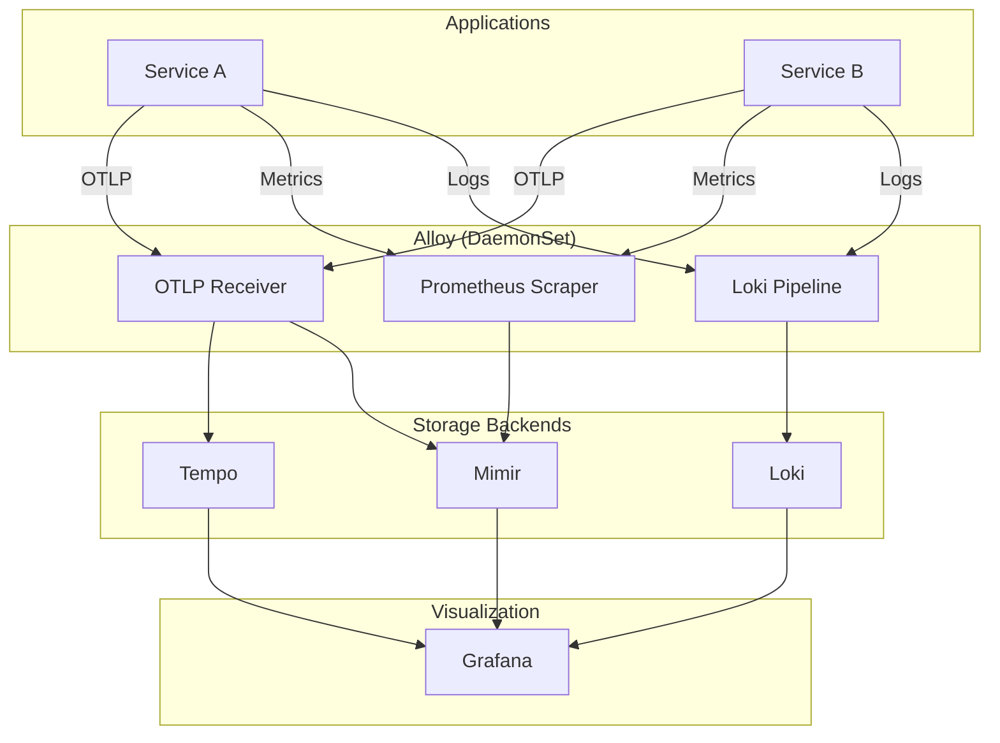

# SPEC: Observability Stack Configuration

## Overview

Grafana LGTM stack configuration for unified observability.

## Architecture



## Component Configuration

### Alloy (Unified Collector)

```river
// OTLP receiver for traces
otelcol.receiver.otlp "default" {
  grpc {
    endpoint = "0.0.0.0:4317"
  }
  http {
    endpoint = "0.0.0.0:4318"
  }
  output {
    traces  = [otelcol.exporter.otlp.tempo.input]
    metrics = [otelcol.exporter.prometheus.mimir.input]
  }
}

// Prometheus scraping
prometheus.scrape "kubernetes" {
  targets = discovery.kubernetes.pods.targets
  forward_to = [prometheus.remote_write.mimir.receiver]
}

// Log collection
loki.source.kubernetes "pods" {
  targets    = discovery.kubernetes.pods.targets
  forward_to = [loki.write.default.receiver]
}
```

### Storage Retention

| Component | Retention | Storage |
|-----------|-----------|---------|
| Loki (logs) | 7 days | MinIO |
| Tempo (traces) | 7 days | MinIO |
| Mimir (metrics) | 30 days | MinIO |

## Cardinality Management

### Best Practices

```yaml
# Good: Bounded labels
http_requests_total{service, endpoint, method, status_code}
# ~10 services × 50 endpoints × 5 methods × 20 codes = 50,000

# Bad: Unbounded labels
http_requests_total{user_id, request_id}
# Millions of users × Billions of requests = DISASTER
```

### Cardinality Limits (Mimir)

```yaml
limits:
  max_label_names_per_series: 30
  max_series_per_user: 5000000
  max_series_per_metric: 50000
  ingestion_rate: 25000
```

## Key Queries

### LogQL (Loki)

```promql
# Errors in namespace
{namespace="<tenant>-prod"} |= "error" | json | level="error"

# Slow requests
{namespace="<tenant>-prod"} | json | response_time > 1000
```

### PromQL (Mimir)

```promql
# Error rate
sum(rate(http_requests_total{status=~"5.."}[5m])) by (service)

# P95 latency
histogram_quantile(0.95, rate(http_request_duration_seconds_bucket[5m]))
```

### TraceQL (Tempo)

```
{resource.service.name="<tenant>-api"} | duration > 1s
```

## Related

- [ADR-OBSERVABILITY-STACK](./ADR-OBSERVABILITY-STACK.md)
